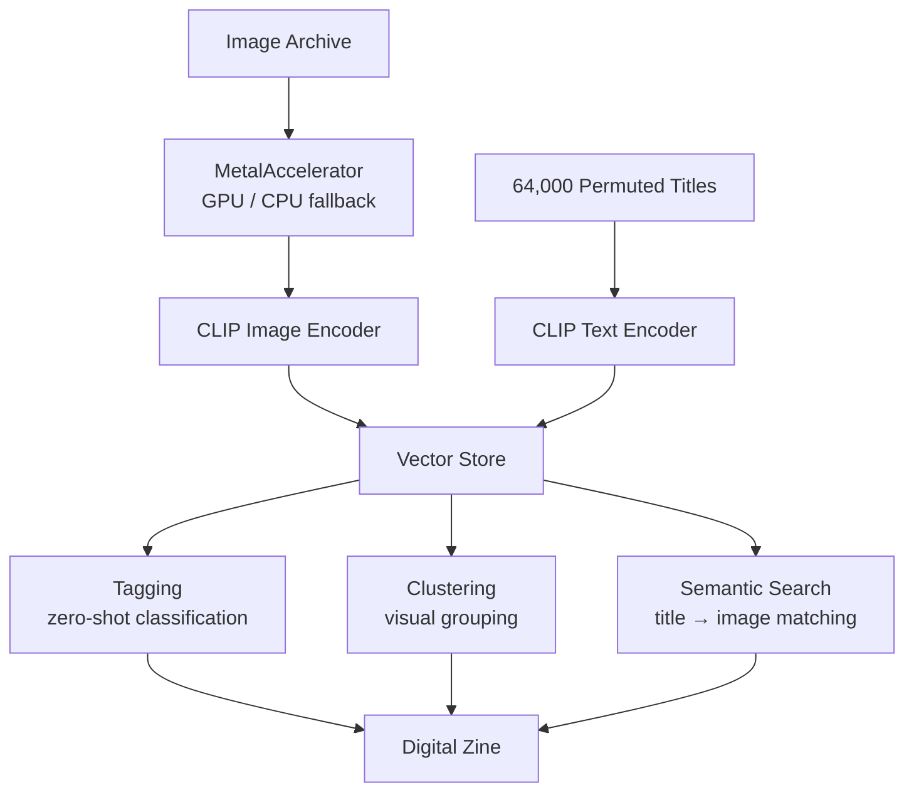

# potential-match

GPU-accelerated image recognition for a digital zine — tagging, clustering, and semantic search across an image archive navigated by 64,000 permuted titles.

## Concept

An image archive explored through permuted text titles. CLIP embeddings bridge the gap between title permutations and visual content, enabling semantic navigation where titles "find" their images.

## Architecture



## Setup

```bash
python3 -m venv venv
source venv/bin/activate
pip install -r requirements.txt
```

## Origin

GPU acceleration module forked from [metalcut](https://github.com/joaodotwork/metalcut).
