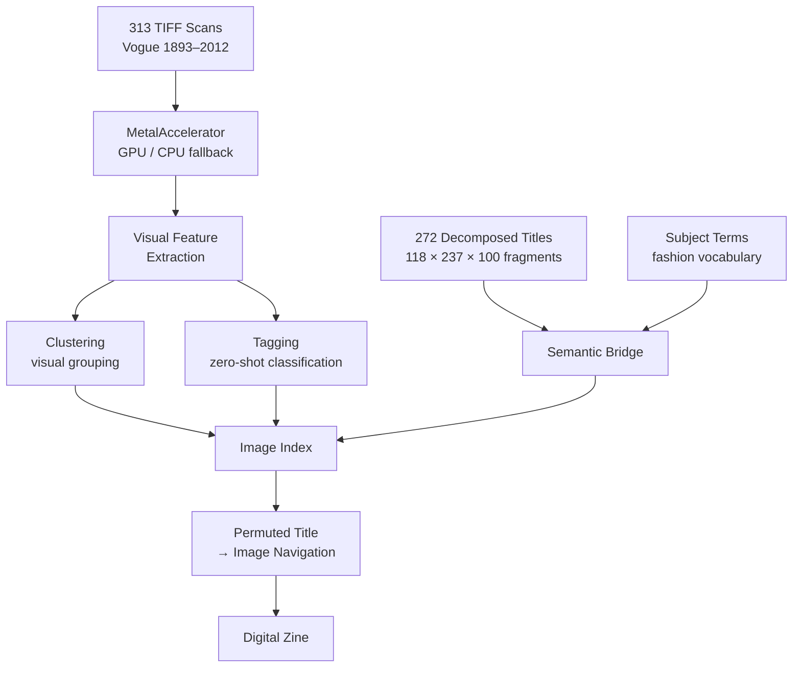

# potential-match

GPU-accelerated image recognition for a digital zine — tagging, clustering, and semantic search across a Vogue "How To" archive (1893–2012), navigated by permuted title fragments.

## Concept

120 years of Vogue "How To" articles — from "How To Touch Her Heart" (1893) to "How To Knock The Stuffiness Out Of Fur" (2012) — decomposed into opener / middle / closer fragments and recombined as a navigational interface into 313 archival images.

The combinatorial poetry of permuted titles becomes the lens: *"How To Be Moneyed / A Cruise / ...and One Fur Beret"* finds its way to the right images through a semantic bridge between language and visual content.

## Architecture



## Source Material

| Asset | Details |
|-------|---------|
| Images | 313 high-res TIFFs (~3.9GB), photographs & illustrations |
| Metadata | Title, year, abstract, authors, subject terms, companies |
| Titles | 272 "How To" titles split into 3-part fragments |
| Span | 1893–2012 (120 years) |
| Source | ProQuest Vogue Archive |

## Setup

```bash
python3 -m venv venv
source venv/bin/activate
pip install -r requirements.txt
```

## Origin

GPU acceleration module from [metalcut](https://github.com/joaodotwork/metalcut). Collaboration with Linda van Deursen.
